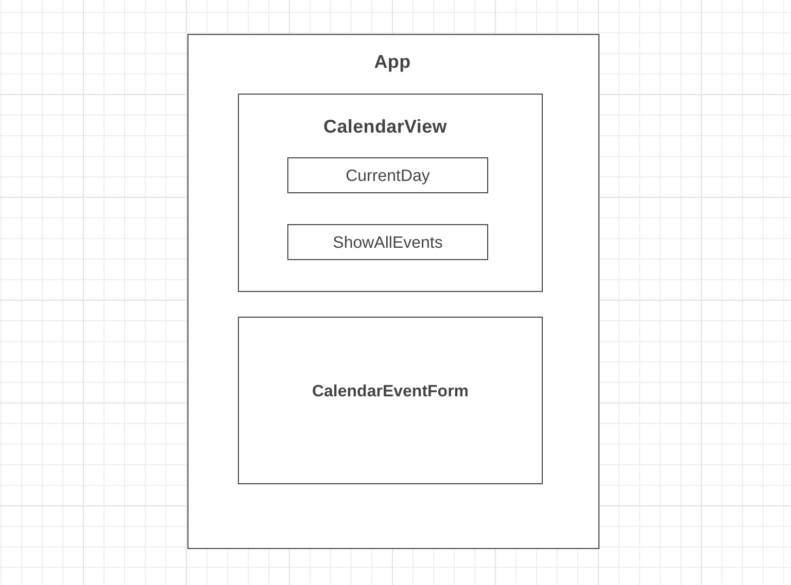
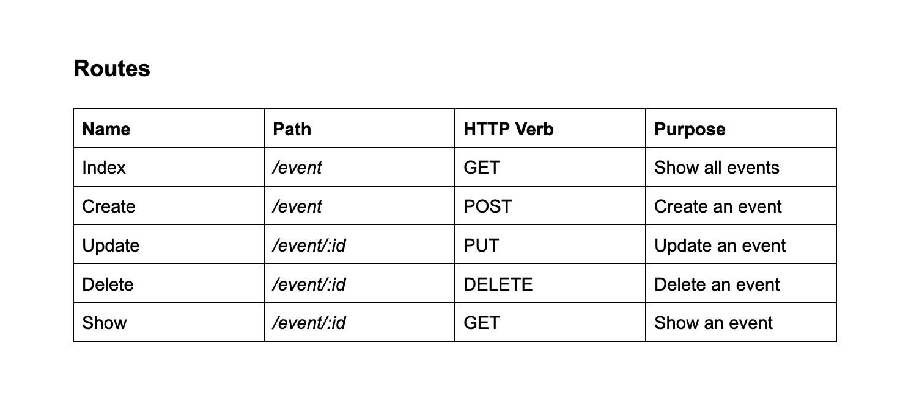

# Live Site
https://ubiquitous-cocada-367feb.netlify.app/

# Backend GitHub Repo
https://github.com/madhu-mida/react-calendar-mern-backend

**Summary**

| Field | Detail |
|--------|-----|
| Project Name | Weekly Calendar Scheduler|
| Description | A website where users can create and maintain schedule|
| Live Website Frontend | https://ubiquitous-cocada-367feb.netlify.app/|
| Live Website Backend | https://ms-react-mern-calendar.herokuapp.com/ |
| Repo Frontend| https://github.com/madhu-mida/react-calendar-mern-frontend |
| Repo Backend|  https://github.com/madhu-mida/react-calendar-mern-backend|

## Technologies Used
- HTML5                  
- CSS3                   
- JavaScript             
- JQuery
- Express
- Node
- React 

##### Wireframe

##### Future Enhancements

- Monthly Scheduler
- Alert Notifications